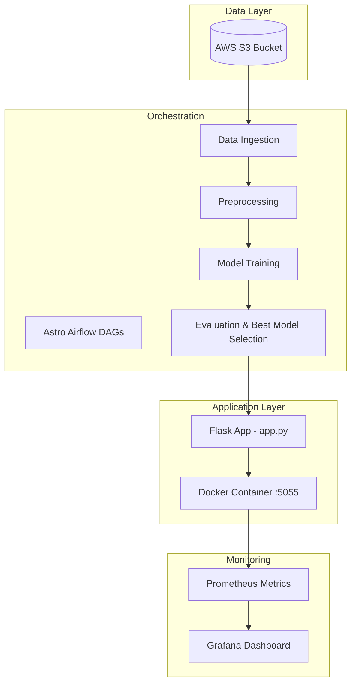

 # 🚖 TaxiFlow

[](https://www.python.org/)
[](https://airflow.apache.org/)
[](https://www.docker.com/)
[](https://aws.amazon.com/s3/)
[](https://prometheus.io/)
[](https://grafana.com/)
[](https://github.com/features/actions)

---

## Overview

**TaxiFlow** is an **end-to-end ML pipeline** for taxi trip predictions. It automates:

* Data fetching from **S3** using **Astro Airflow**
* Data ingestion & preprocessing
* Model training and evaluation
* Best model selection for production
* Triggering **Flask app (`app.py`)** for serving predictions
* Dockerized deployment on port **5055**
* Monitoring via **Prometheus & Grafana**
* CI/CD automation using **GitHub Actions**

---

## 🏗 Architecture Diagram



---

## 🔹 DAG Structure

* **`ingest_task`** – Fetches data from **S3**
* **`preprocess_task`** – Cleans, scales, encodes data
* **`train_task`** – Trains multiple ML models
* **`evaluate_task`** – Picks best model based on metrics
* **`trigger_app_task`** – Deploys the best model via **Flask app**

Each task is modular, so adding new preprocessing steps or models is easy.

---

## 🐳 Docker Setup for Flask App

```dockerfile
FROM python:3.11-slim

WORKDIR /app

COPY requirements.txt .
RUN pip install --no-cache-dir -r requirements.txt

COPY dags /app/dags
COPY include /app/include
COPY app.py /app/app.py
COPY assets /app/assets

EXPOSE 5055

CMD ["python", "app.py"]
```

**Run the container:**

```bash
docker build -t taxiflow-app .
docker run -d -p 5055:5055 taxiflow-app
```

---

## 🛠 Docker Setup for Astro Airflow

If you want to **run Astro Airflow in Docker**, use this base image:

```dockerfile
FROM astrocrpublic.azurecr.io/runtime:3.0-10

```

**Run Astro Airflow container:**

```bash
astro dev init
astro dev start
```

This allows you to **orchestrate DAGs** while keeping Flask app separate.

---

## 📊 Prometheus & Grafana Integration

1. Expose metrics in **`app.py`** using Prometheus client:

```python
from prometheus_client import Counter, generate_latest, CONTENT_TYPE_LATEST
```

2. Add a **`/metrics` endpoint** to Flask app.
3. Connect **Grafana** to Prometheus to visualize:

* Number of predictions
* Model inference time
* Errors

---

## ⚙️ CI/CD with GitHub Actions

```yaml
name: CI/CD for Astro Airflow

on:
  push:
    branches: [ "main" ]
  pull_request:
    branches: [ "main" ]

jobs:
  build-and-run:
    runs-on: ubuntu-latest

    steps:
      # 1️⃣ Checkout repository
      - name: Checkout repo
        uses: actions/checkout@v3

      # 2️⃣ Install Docker (official way, avoids containerd conflicts)
      - name: Install Docker
        run: |
          curl -fsSL https://get.docker.com -o get-docker.sh
          sudo sh get-docker.sh
          sudo usermod -aG docker $USER
          docker --version

      # 3️⃣ Install Astro CLI
      - name: Install Astro CLI
        run: |
          curl -sSL https://install.astronomer.io | sudo bash
          astro version

      # 4️⃣ Initialize Astro project (if Dockerfile not present)
      - name: Initialize Astro project
        run: |
          if [ ! -f "Dockerfile" ]; then
            astro dev init
          fi

      # 5️⃣ Start Astro Airflow in background
      - name: Start Astro Airflow
        run: |
          nohup astro dev start > airflow.log 2>&1 &
          echo "Waiting for Airflow webserver on port 8080..."
          for i in {1..30}; do
            if curl -s http://localhost:8080/health | grep "healthy"; then
              echo "✅ Airflow started"
              break
            else
              sleep 5
            fi
          done

      # 6️⃣ Build Docker image
      - name: Build Docker image
        run: |
          astro dev build
          # Tag the built image
          docker tag $(docker images --format "{{.Repository}}:{{.Tag}}" | grep airflow) my-astro-airflow:latest

      # 7️⃣ Run Docker container
      - name: Run Docker container
        run: |
          docker run -d --name astro-container -p 8080:8080 my-astro-airflow:latest
          echo "Container started"
          sleep 20

      # 8️⃣ Optional cleanup
      - name: Cleanup Docker container
        if: always()
        run: |
          docker stop astro-container || true
          docker rm astro-container || true
```

---

## 📸 Screenshots / Demo

1️⃣ **Airflow DAGs** 

2️⃣ **Successful run Airflow** 

3️⃣ **DAGs detail** 

4️⃣ **Prometheus Metrics** 

5️⃣ **Grafana Dashboard** 

6️⃣ **Running App** 

7️⃣ **Docker Container** 


---

## 🛠 Tech Stack

| Layer            | Technology                                       |
| ---------------- | ------------------------------------------------ |
| Orchestration    | Astro Airflow                                    |
| Data Storage     | AWS S3                                           |
| Programming      | Python 3.11                                      |
| Containerization | Docker                                           |
| Monitoring       | Prometheus, Grafana                              |
| CI/CD            | GitHub Actions                                   |
| ML Framework     | scikit-learn / XGBoost / LightGBM (customizable) |

📄 License

This project is licensed under the Apache License 2.0
.

© 2025 Harshit Rai
